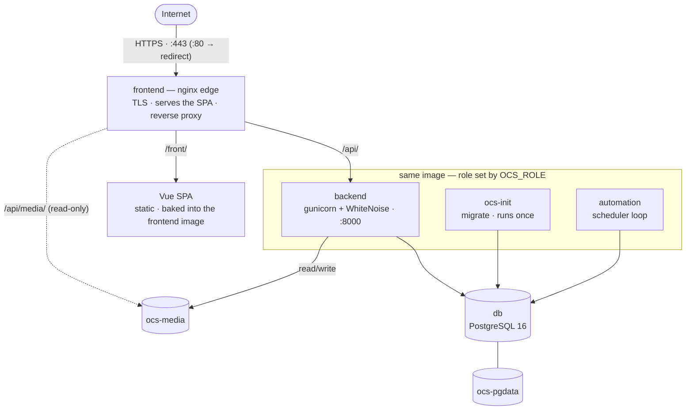
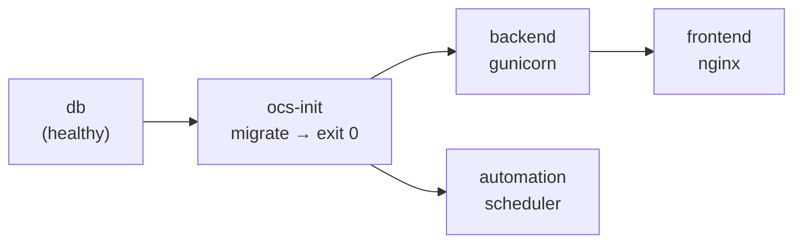

# Architecture

## Topology

A single hostname serves both the UI and the API (same origin → no CORS needed).

Arrows show traffic/data flow; `backend`, `ocs-init` and `automation` are the
**same image** (grouped), not connected to each other.

## URL mapping

| Public URL | Handled by |
|------------|-----------|
| `/` | nginx → redirect to the UI base path |
| `/front/`, `/front/ocsreports/...` | SPA (`index.html`, `try_files` fallback) |
| `/front/assets/...`, `/front/config/config.json` | SPA static assets |
| `/api/...` | `proxy_pass` to `backend:8000` (the `/api` prefix is stripped) |
| `/api/static/...` | backend → WhiteNoise |
| `/api/media/...` | nginx serves the shared media volume directly |
| `/api/asset/legacy/`, `/api/asset/collection/` | OCS agent endpoints |

Both base paths are configurable — see [Base paths](configuration/base-paths.md).

## How requests reach Django (the `/api` prefix)

nginx strips the API prefix before proxying, so the backend receives
`/user/`, `/asset/legacy/`, … . Django is told it lives under that prefix with
`FORCE_SCRIPT_NAME` (derived from `API_BASE_PATH`), so every URL it generates
(static, redirects, DRF browsable API) carries the prefix. WhiteNoise is told to
match the **stripped** prefix it actually receives. Details in
[Django settings overlay](configuration/django-overlay.md).

## Startup order

`ocs-init` runs first and to completion (migrations). `backend` and `automation`
start only after it succeeds (`depends_on: service_completed_successfully`), so
there is never a migration race. `db` has a healthcheck the others wait on.

Each arrow means *"must be ready before"* (`depends_on`): the database before
`ocs-init`, `ocs-init` before `backend`/`automation`, and `backend` before `frontend`.

## Runtime-rendered frontend config

The `frontend` image is built once with a sentinel base path. On **every container
start**, its entrypoint:

1. materializes the SPA under the requested base segment from an immutable master
   copy, rebasing the sentinel to `FRONTEND_BASE_PATH`;
2. writes `config/config.json` (the backend URL the browser calls);
3. renders the nginx config from a template (`envsubst`) using the base paths,
   ports, and backend upstream.

So the UI base path, API prefix, public ports and backend address are runtime
settings — no rebuild to change them. See [Base paths](configuration/base-paths.md)
and [TLS & networking](configuration/tls-and-networking.md).

## Images

* `backend`, `ocs-init`, `automation` → `ghcr.io/vdeville/ocsinventory-backend`
  (one image, selected role via `OCS_ROLE`).
* `frontend` → `ghcr.io/vdeville/ocsinventory-frontend` (Vue build + nginx).
* `db` → `postgres:16-alpine`.

Images are built from pinned OCS tags and published per version (`:<version>`).
See [Releasing a version](developer/releasing.md).

## Persistence

| Volume | Used by | Holds |
|--------|---------|-------|
| `ocs-pgdata` | `db` | PostgreSQL data |
| `ocs-media` | `backend` (rw), `frontend` (ro) | uploads: deployment packages, filemanager |

Static files are **not** a volume — they are baked into the backend image at
build time and served by WhiteNoise.
